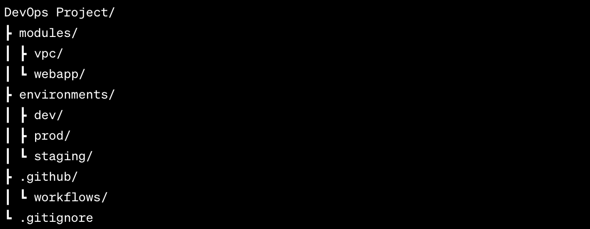

# DevOps Project (AWS, Terraform, Git, Linux, CI/CD)

## Overview
This project is an automated infrastructure deployment and CI/CD project that leverages the power of AWS, Terraform, GitHub Actions, and Git to deploy an Nginx Web App in three different production environments.

This project focuses on:

- Creating custom reusable modules for the VPC and Web App to ensure consistency and reduce duplication using DRY principles.
- Incorporating best practices for security and network design to provision various AWS resources, including VPCs, subnets, instances, and ALBs.
- Using GitHub Actions workflows to enable automated updates to the infrastructure on pushes and pulls to the master branch.

## Directory Structure
The project is organized into the following directory structure:



The directory structure is clear and organized for the different components of the project:

- `modules`: Allows us to use reusable modules for the VPC and web application across different environments.
- `environments`: Allows us to set specific configuration variables required for each production environment. In our case, we have three environments: dev, staging, and production.
- `.github`: Will be used for our GitHub Actions workflows in the CI/CD stage.
- `.gitignore`: Will be used to hide files containing sensitive details, e.g., terraform.tfstate.

## Modules: VPC
To ensure consistency and make our code reusable across different production environments, we'll be using a variables.tf file.

`Variables.tf` Components:
- VPC CIDR
- Environment Variable (to allow selection of the production environment)
- Public and Private Subnets
- Availability Zones
```
variable "vpc_cidr" {
  description = "VPC CIDR"
  type        = string
  default     = ""
}
variable "environment" {
  type    = string
  default = ""
}
variable "public_subnets" {
  type    = list(string)
  default = []
}
variable "private_subnets" {
  type    = list(string)
  default = []
}
variable "azs" {
  type    = list(string)
  default = []
}
```

To access the outputs of our module, we'll also be creating an outputs.tf file.

`Outputs.tf` Components:
- VPC ID
- Public and Private Subnet IDs
- NAT Gateway ID
- Public Route Table and Private Route Table ID
- Internet Gateway ID
```
output "vpc_id" {
  value = aws_vpc.webapp_vpc.id
}
output "public_subnet_ids" {
  value = aws_subnet.public_subnet[*].id
}
output "private_subnet_ids" {
  value = aws_subnet.private_subnet[*].id
}
output "nat_gateway_ids" {
  value = aws_nat_gateway.webapp_ngw[*].id
}
output "public_route_table_id" {
  value = aws_route_table.public_rt.id
}
output "private_route_table_id" {
  value = aws_route_table.private_rt[*].id
}
output "internet_gateway_id" {
  value = aws_internet_gateway.webapp_igw.id
}
```

Now to the main event of our VPC module. In order to create our VPC with the goal of deploying an NGINX server we will need the following resources:

`Main.tf` Resources:
- VPC
    - The VPC serves as the isolated network environment where your resources will reside. It defines the IP address range (CIDR block) for the network.
- Internet Gateway
    - The Internet Gateway enables communication between your VPC and the public internet. It's essential for resources in your public subnets to access external services and for users to reach your application.
- Public Subnet
    -  Public subnets host resources that need direct internet access, such as load balancers. They are associated with the VPC and defined by a specific CIDR block and availability zone. In our case the load balancer will be in the public subnet.
- Private Subnet
    - Private subnets host resources that should not have direct internet access. In our case the webapp will sit here and will connect to the internet through our NAT Gateway. Similar to public subnets, they are associated with the VPC, designated by a distinct CIDR block and availability zone.
- Public Route Table and Route
    - This route table directs traffic within the VPC. In our case, the Public Route sends traffic destined for the internet to the Internet Gateway. 
- Elastic IP (Conditional)
    - Elastic IPs provide consistent public IP addresses for resources like NAT Gateways, ensuring reliable connectivity with external networks.
    - Here we have a conditional argument with the count. The conditional expression ensures that the code will create multiple Elastic IPs (one for each public subnet) if the environment is "Production", and only a single Elastic IP if it's not. This helps save costs in the Dev and Staginging environment productions.
- NAT Gateway
    - The NAT Gateway allows private instances in the VPC's private subnets to access the internet while remaining secure. In our case our webapp will be sitting in the private subnets. 
    - There is another conditional argument with the count. When the environment is set to "Production", the count is set to the number of public subnets, resulting in multiple NAT Gateways, each associated with an Elastic IP and a distinct public subnet. Conversely, for non-production environments, a single NAT Gateway is created. This again to help save costs in the Dev and Staginging environment productions.
- Private Route Table and Route
    - This route table is used by private subnets to direct outbound traffic through the NAT Gateway, ensuring secure internet access for our webapp.
- Public Route Table Association and Private Route Table Association
    - These associations link the subnets to their respective route tables, ensuring proper routing of network traffic within the VPC.

```
# VPC Module
# VPC
resource "aws_vpc" "webapp_vpc" {
  cidr_block = var.vpc_cidr
  tags = {
    Name = "${var.environment} webapp vpc"
    Environment = var.environment
  }
}

# IGW
resource "aws_internet_gateway" "webapp_igw" {
  vpc_id = aws_vpc.webapp_vpc.id
  tags = {
    Name = "Webapp IGW"
    Environment = var.environment
  }
}

# Public Subnet
resource "aws_subnet" "public_subnet" {
  count = length(var.public_subnets)
  vpc_id = aws_vpc.webapp_vpc.id
  cidr_block = var.public_subnets[count.index]
  availability_zone = var.azs[count.index]
  tags = {
    Name = "Public ${var.azs[count.index]}"
  }
}

# Private Subnet
resource "aws_subnet" "private_subnet" {
  count = length(var.private_subnets)
  vpc_id = aws_vpc.webapp_vpc.id
  cidr_block = var.private_subnets[count.index]
  availability_zone = var.azs[count.index]
  tags = {
    Name = "Private ${var.azs[count.index]}"
  }
}

# Public route table and route
resource "aws_route_table" "public_rt" {
  vpc_id = aws_vpc.webapp_vpc.id
  route {
    cidr_block = "0.0.0.0/0"
    gateway_id = aws_internet_gateway.webapp_igw.id
  }
  tags = {
    Name = "${var.environment}-public-rt"
  }
}

# Elastic IP (Conditional)
resource "aws_eip" "eip" {
  count = var.environment == "Production" ? length(aws_subnet.public_subnet) : 1
  tags = {
    Name = "${var.environment}-eip"
    Environment = var.environment
  }
}

# NAT GW
resource "aws_nat_gateway" "webapp_ngw" {
  count = var.environment == "Production" ? length(aws_subnet.public_subnet) : 1
  allocation_id = aws_eip.eip[count.index].id
  connectivity_type = "public"
  subnet_id = var.environment == "Production" ? aws_subnet.public_subnet[count.index].id : aws_subnet.public_subnet[0].id
  tags = {
    Name = "${var.environment}-nat-gateway"
    Environment = var.environment
  }
}

# Private route table and route
resource "aws_route_table" "private_rt" {
  count = length(aws_subnet.private_subnet)
  vpc_id = aws_vpc.webapp_vpc.id
  route {
    cidr_block = "0.0.0.0/0"
    nat_gateway_id = var.environment == "Production" ? aws_nat_gateway.webapp_ngw[count.index].id : aws_nat_gateway.webapp_ngw[0].id
  }
  tags = {
    Name = "${var.environment}-${var.azs[count.index]}-private-route-table"
  }
}

# Public rt association
resource "aws_route_table_association" "public_rt_assoc" {
  count          = length(aws_subnet.public_subnet)
  subnet_id      = aws_subnet.public_subnet[count.index].id
  route_table_id = aws_route_table.public_rt.id
}

# Private rt association
resource "aws_route_table_association" "private_rt_assoc" {
  count          = length(aws_subnet.private_subnet)
  subnet_id      = aws_subnet.private_subnet[count.index].id
  route_table_id = aws_route_table.private_rt[count.index].id
}
```

## Modules: Webapp
This webapp module will create or EC2 instances running our NGINX webapp and our application load balancer.

`Variables.tf` Components:
- Environment Variable (to allow selection of the production environment)
- Public Subnets
- Private Subnets
- Public Subnets ID
- Private Subnets ID
- VPC ID
- Instance Type
- Key Name
```
variable "environment" {
  type = string
  default = ""
}
variable "public_subnets" {
  type = list
  default = []
}
variable "private_subnets" {
  type = list
  default = []
}
variable "private_subnet_ids" {
}
variable "public_subnet_ids" {
}
variable "vpc_id" {
  type = string
  default = ""
}
variable "instance_type" {
  type = string
  default = ""
}
variable "key_name" {
  type = string
  description = "Key pair name"
  default = ""
}
```

To access the outputs of our module, we'll also be creating an outputs.tf file.

`Outputs.tf` Components:
- Application Loadbancer DNS Name
- Private Instance ID
- Private Instance Private IPs
```
output "alb_dns_name" {
  value = aws_lb.webapp_alb.dns_name
}
output "private_instance_ids" {
  value = aws_instance.webapp_instance[*].id
}
output "private_instance_private_ips" {
  value = aws_instance.webapp_instance[*].private_ip
}
```

Now again to our main event. To deploy the webapp we need the following resources:
- Instance 
    - This resource is key for deploying the webapp. It will deploy an instance within the private subnets, with the specified AMI, Instance type, security group, and key.
    - Within this respurce were also using custom user data scripting to set up the instance with the neccessary software to run an NGINX server.
    - The necessary key needed has been generated from the aws console.
- AMI Datasource
    - This ensures the latest Amazon Linux 2 AMI is fetched.
- Application Load Balancer Security Group
    - The security group for the Application Load Balancer (ALB) controls traffic access to our instances. Inbound rules allow HTTP traffic from the internet (port 80), while outbound rules allow all traffic. 
- Application Load Balancer
    - The ALB efficiently distributes incoming traffic across our instances, enhancing availability and fault tolerance. It's connected to the public subnets, allowing external users to access our web application. The security group limits access and ensures a controlled flow of traffic.
- Target Group
    - This target group defines how the ALB routes traffic to instances. It's responsible for monitoring and maintaining the health of instances using a health check. The ALB relies on this group to forward traffic effectively.
- ALB Listener
    - The listener on the ALB defines how it listens for incoming traffic. This configuration directs incoming HTTP traffic (port 80) to the specified target group for distribution among instances.
- Target Group Attachment (aws_lb_target_group_attachment)
    - This resource attaches each instance to the target group, enabling the ALB to distribute traffic to our instances. The count feature ensures proper attachment for each instance.  

## Environment
Now that our modules are complete, we can progress to our environments folder. Each environment will have an identical `main.tf`, `variables.tf`, and `versions.tf` file.
To make use of the modules we created, we need to call them within the `main.tf` file:

`main.tf`:
```
# VPC Module
module "vpc" {
  source = "../../modules/vpc"

  environment     = var.environment
  vpc_cidr        = var.vpc_cidr
  public_subnets  = var.public_subnets
  private_subnets = var.private_subnets
  azs             = var.azs
}

# Instance and ALB Module
module "webapp" {
  source = "../../modules/webapp"

  vpc_id             = module.vpc.vpc_id
  environment        = var.environment
  public_subnet_ids  = module.vpc.public_subnet_ids
  private_subnet_ids = module.vpc.private_subnet_ids
  instance_type      = var.instance_type
  key_name           = var.key_name

}
```

Then we need to create our `variables.tf` and `versions.tf` file:

`versions.tf`:
```
# Terraform Block
terraform {
  required_version = ">= 1.0"
  required_providers {
    aws = {
      source  = "hashicorp/aws"
      version = "~> 5.0.0"
    }
  }
  backend "s3" {
    bucket = "tf-state-deenginers-project"
    key    = "dev/terraform.tfstate"
    region = "eu-west-2"
  }
}

# Provider Block
provider "aws" {
  region  = var.aws_region
}
```
Here we also use a remote backend to store our tfstate and and lock files in a s3 bucket and dynamoDB backend respectivley. 

`variables.tf`:
```
# Environment
variable "environment" {
  type        = string
  description = "When set to dev/staging: Only one nat gateway and eip will be created. However, when set to production: One nat gateway and eip for every public subnet"
  default     = ""
}

# VPC Vars
variable "vpc_cidr" {
  description = "VPC CIDR"
  type        = string
  default     = ""
}
variable "public_subnets" {
  type = list(string)
}
variable "private_subnets" {
  type = list(string)
}
variable "azs" {
  type    = list(string)
  default = []
}

# Webapp Vars
variable "key_name" {
  type    = string
  default = "webappkey"
}
variable "instance_type" {
  type    = string
  default = ""
}

# Generic vars
# Region
variable "aws_region" {
  description = "Region in which AWS Resources to be created"
  type        = string
  default     = ""
}

# Backend Config
variable "bucket_name" {
  type    = string
  default = ""
}
variable "dynamodb_name" {
  type    = string
  default = "dev"
}
```
The variables here (except webapp key) are empty and not defined. As we have created reusable modules to deploy our infrastructure across different production environments, most of our variables will change to reflect their respective environment. Rather than define them within our `variables.tf` we will define them within a `terraform.tfvars` file.


